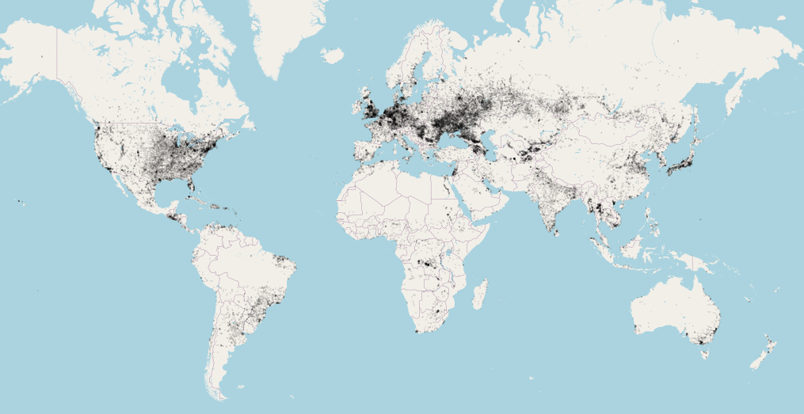

# geojson-world-cities

This repo provides a geojson file for city boundaries around the world.
Free to use for any project.



## About the dataset

* The data is sourced from http://www.vdstech.com/world-data.aspx and converted with http://ogre.adc4gis.com/.
* There are 37,372 cities with defined Polygon boundaries with the precision of 5 decimal points (about 1 meter),
although accuracy of the data (how well the polygons define the real-world city boundaries) varies greately.
* Each polygon is only identifiable by city `NAME`, from no particular standard.
There are many cities with the same name.
(eg there are 11 `SPRINGFIELD`s and 2 `MOSCOW`s), either due to duplication or because
they are located in different counties/states.
* Cities with `NAME = null` were removed by [@ilyankou](https://github.com/ilyankou).

## Example feature
```js
{
  "type": "Feature",
  "properties": {
    "NAME": "LETKI"
    },
  "geometry": {
    "type": "Polygon",
    "coordinates": [
      [
        [ 44.55894, 54.30577 ],
        [ 44.55198, 54.30724 ],
        [ 44.5507,  54.31366 ],
        [ 44.54092, 54.32204 ],
        [ 44.54182, 54.32476 ],
        [ 44.54499, 54.32563 ],
        [ 44.56358, 54.32214 ],
        [ 44.5689,  54.31886 ],
        [ 44.55894, 54.30577 ]
      ]
    ] 
  } 
}
```

## License

Apache-2.0. Free to use for any project.